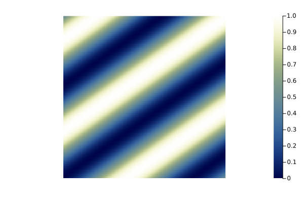
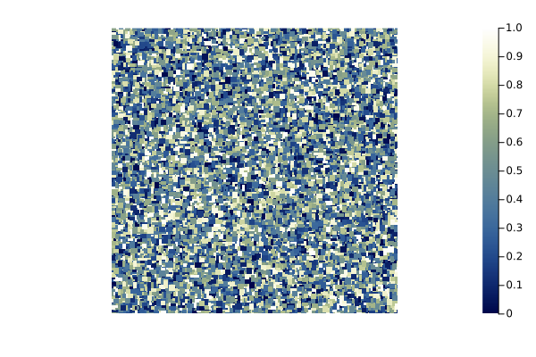
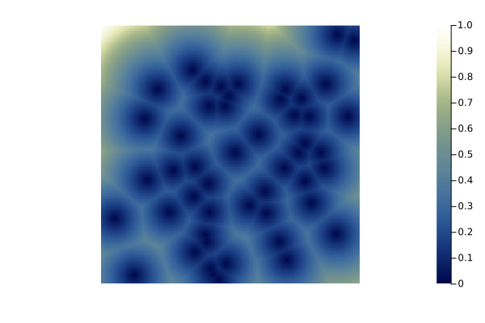
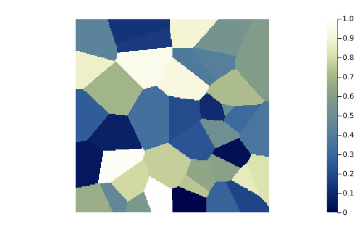

```julia
using NeutralLandscapes
using Plots

function demolandscape(alg::T) where {T <: NeutralLandscapeMaker}
    heatmap(rand(alg, (200, 200)), frame=:none, aspectratio=1, c=:davos)
end
```


```ansi
demolandscape (generic function with 1 method)
```


## No gradient {#No-gradient}

```julia
demolandscape(NoGradient())
```

{width=600px height=400px}

## Planar gradient {#Planar-gradient}

```julia
demolandscape(PlanarGradient(35))
```

{width=600px height=400px}

## Edge gradient {#Edge-gradient}

```julia
demolandscape(EdgeGradient(186))
```

{width=600px height=400px}

## Wave surface {#Wave-surface}

```julia
demolandscape(WaveSurface(35, 3))
```

{width=600px height=400px}

## Rectangular cluster {#Rectangular-cluster}

```julia
demolandscape(RectangularCluster())
```

{width=600px height=400px}

## Distance gradient {#Distance-gradient}

```julia
sources = unique(rand(1:40000, 50))
demolandscape(DistanceGradient(sources))
```

{width=600px height=400px}

## Nearest-neighbor element {#Nearest-neighbor-element}

```julia
heatmap(rand(NearestNeighborElement(20, 1), (45, 45)))
```

{width=600px height=400px}

## Voronoi {#Voronoi}

```julia
demolandscape(DiscreteVoronoi(40))
```

{width=600px height=400px}

## Perlin Noise {#Perlin-Noise}

```julia
demolandscape(PerlinNoise())
```

{width=600px height=400px}

## Classify landscape {#Classify-landscape}

```julia
sources = unique(rand(1:40000, 50))
heatmap(NeutralLandscapes.classify!(rand(DistanceGradient(sources), (200, 200)), [0.5, 1, 1, 0.5]))
```

{width=600px height=400px}

## Diamond Square {#Diamond-Square}

```julia
demolandscape(DiamondSquare())
```

{width=600px height=400px}

## Midpoint Displacement {#Midpoint-Displacement}

```julia
demolandscape(MidpointDisplacement())
```

{width=600px height=400px}
